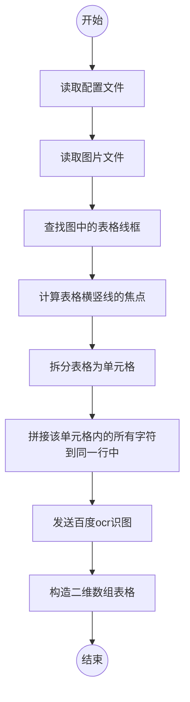
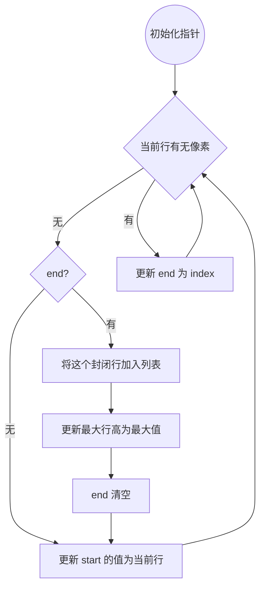

# 表格形状图片 `OCR`
本项目用于对表格中的图片进行识别，并基于百度OCR API 实现。百度 `ocr` 提供每月 1000 次的免费识别额度。

依赖 `caffeine` 提供的精简 `web` 服务，可以快速搭建一个读取 `RESTful` 接口，在向 `caffeine` 存储后，只需携带 `id` 进行获取即可。关于 `caffeine` 的介绍请见 [caffeine - minimum viable backend](https://github.com/rehacktive/caffeine)

# 使用方法
1. 将 `config.example.ini` 更名为 `config.ini` 并修改其中的参数
2. 调用 `read_image` 方法进行识别与拆分

# 执行流程

计算单元格内行高

- 通过 `start` 和 `end` 两个指针

# 最小行高

关于最小行高的处理，防止同一个字切到多行

